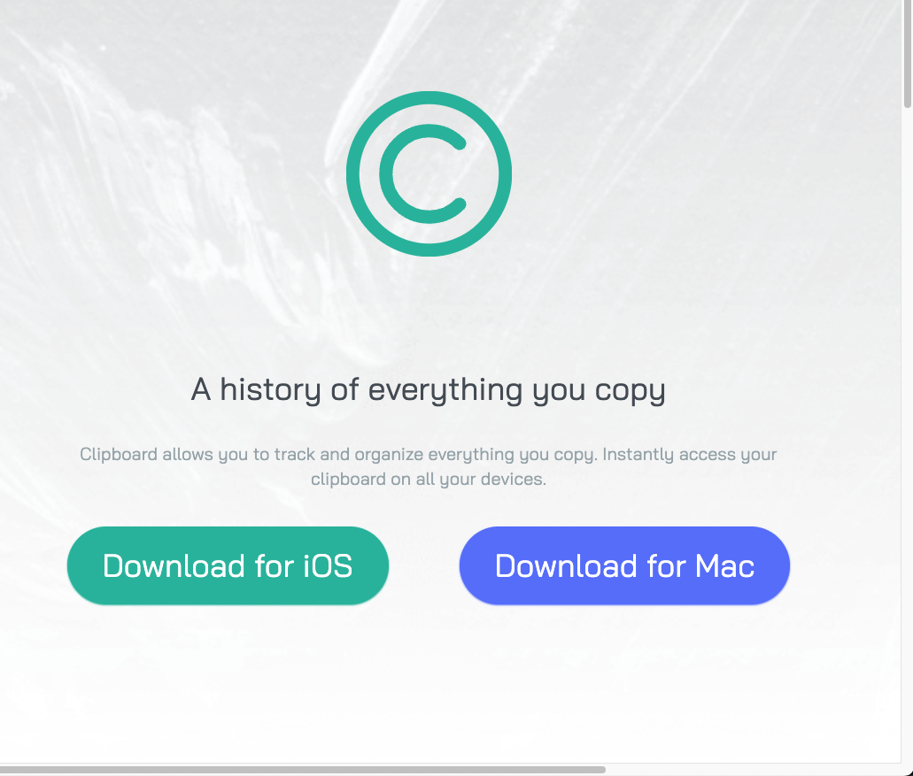

# Frontend Mentor - Clipboard landing page solution

This is a solution to the [Clipboard landing page challenge on Frontend Mentor](https://www.frontendmentor.io/challenges/clipboard-landing-page-5cc9bccd6c4c91111378ecb9). Frontend Mentor challenges help you improve your coding skills by building realistic projects. 

## Table of contents

- [Overview](#overview)
  - [The challenge](#the-challenge)
  - [Screenshot](#screenshot)
- [My process](#my-process)
  - [Built with](#built-with)
  - [What I learned](#what-i-learned)
  - [Continued development](#continued-development)
  - [Useful resources](#useful-resources)
- [Author](#author)
- [Acknowledgments](#acknowledgments)

## Overview

### The challenge

A landing page from Frontend Mentor. 

### Screenshot

## My process

### Built with

- Semantic HTML5 markup
- Tailwind CSS

### What I learned

I still struggle with the application of making everything responsive. I am able to get it, but even using Tailwind  CSS it takes me a while when I am working with sm, md, and large screens. Practice is the only I will get good at this. 

### Continued development

I am going to do another Frontend Mentor and focus on Tailwind CSS and resposiveness. 

### Useful resources

- [Tailwind CSS](https://www.tailwindcss.com) - This helped me for my CSS, I really like it because it is faster than CSS. Even though I had trouble with responsiveness in the project, I would have had an even harder time with Vanilla CSS.

## Author

- Website - [Bek Johannson](https://www.bektothefuture.com)
- Frontend Mentor - [@yourusername](https://www.frontendmentor.io/profile/beksaylor)
- Twitter - [@yourusername](https://www.twitter.com/thedevbek)

## Acknowledgments

I want to thank Frontend Mentor for offering an amazing site for newbies to get patterns. 
